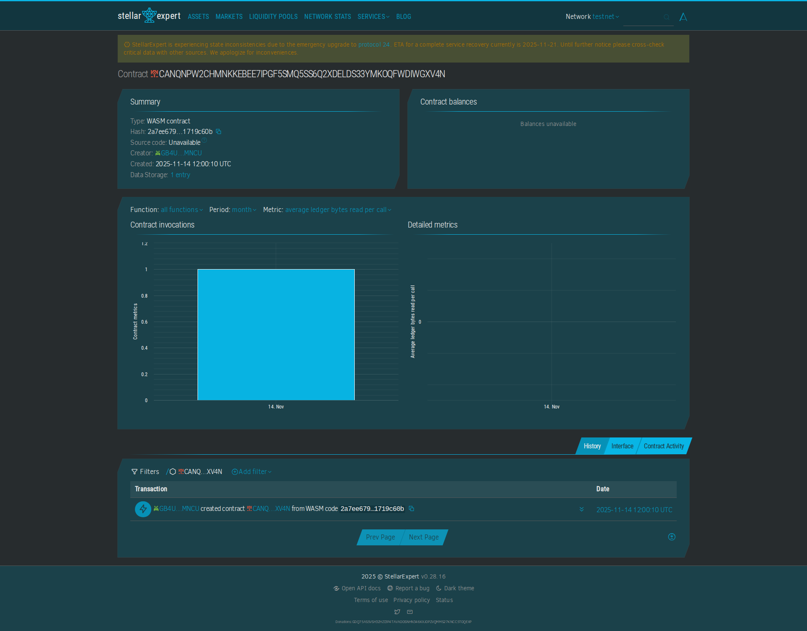

# Feedback Box

## Project Description
The Feedback Box contract enables users to submit and store feedback on the Stellar blockchain. It allows addresses to provide feedback that is permanently recorded and cannot be altered. This provides a transparent way for organizations to collect and maintain feedback from users. The contract uses minimal storage to keep transaction costs low.

This contract is perfect for businesses, organizations, or service providers that want to collect and maintain transparent feedback from users. By storing feedback on the blockchain, you create a permanent record that cannot be deleted or altered, ensuring that all feedback is preserved. The contract is ideal for customer feedback, user suggestions, complaint tracking, or any scenario where you want to maintain a permanent, verifiable record of user feedback.

**Key Benefits:**
- **Permanent Records**: Feedback is stored permanently and cannot be deleted
- **Transparency**: All feedback is publicly verifiable on the blockchain
- **Accountability**: Organizations can demonstrate they value user feedback
- **No Censorship**: Feedback cannot be removed or altered
- **Cost-Effective**: Low storage costs for maintaining feedback systems
- **Global Access**: Feedback can be submitted from anywhere



**Contract Address:** `CANQNPW2CHMNKKEBEE7IPGF5SMQ5SS6Q2XDELDS33YMKOQFWDIWGXV4N`

**View on Stellar Expert:** [https://stellar.expert/explorer/testnet/contract/CANQNPW2CHMNKKEBEE7IPGF5SMQ5SS6Q2XDELDS33YMKOQFWDIWGXV4N](https://stellar.expert/explorer/testnet/contract/CANQNPW2CHMNKKEBEE7IPGF5SMQ5SS6Q2XDELDS33YMKOQFWDIWGXV4N)

## Features
- Simple getter function to retrieve feedback
- Simple setter function to submit feedback
- Basic storage model using address-to-feedback mapping
- Minimal, gas-efficient logic

## Building the Contract

To build use:
```bash
stellar contract build
```

## Deploy to Testnet
Run:

```bash
stellar contract deploy \
  --wasm target/wasm32v1-none/release/project-33.wasm \
  --source-account alice \
  --network testnet \
  --alias project-33
```


